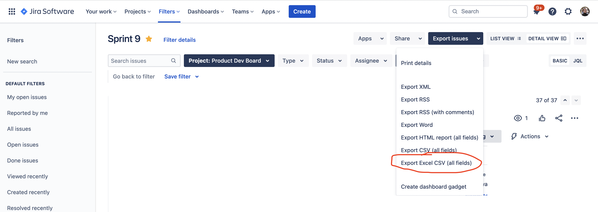

# jira-time-report

Before usage:
1. Locate suitable filter in Jira (on the screenshot below is a filter for current sprint)
2. Export it using 'Export Excel CSV (all fields)' option


Usage:
Insert path to the downloaded CSV instead of `<path_to_csv>` and run:
```
cp config.example.json config.json # you also might want to change or delete `workLogs.filter.from` there
npm i
npm start -- <path_to_csv>
```
